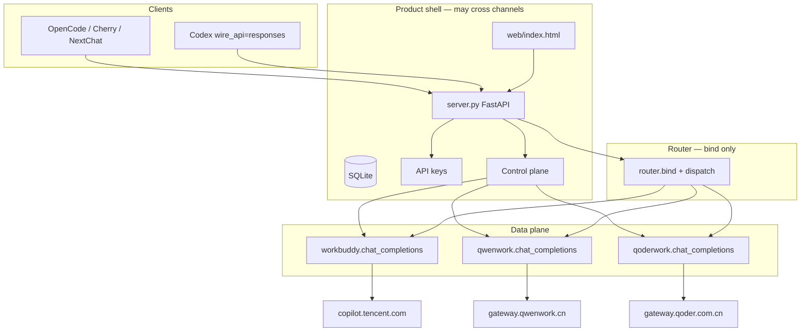
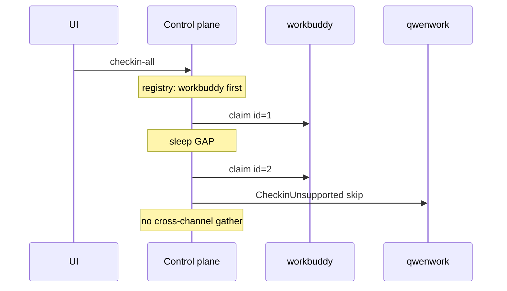

# Buddy2api 2.0 多通道隔离设计

| 字段 | 值 |
|---|---|
| 文档标题 | Buddy2api 2.0：控制面可跨通道、数据面严格隔离 |
| 作者 | Buddy2api maintainers |
| 日期 | 2026-08-25 |
| 修订 | 2026-08-25 r4（用户拍板：QClaw Wave 1；不做 Lingma/Qoder CN；Key 必绑通道 + 下拉切换；版本 2.0.0；QwenWork flag 默认关） |
| 状态 | Draft（Open Questions 已决议） |
| 基线版本 | 1.4.10（`version.py` `VERSION = "1.4.10"`，worktree `design/multi-channel-v2` @ `6da79e1`） |
| 目标概念版本 | **2.0**（`accounts.provider` + 命名空间模型）。**禁止**以 1.4.11 半成品形式带上 QwenWork |
| 范围 | 设计文档。本分支除本文档外不落地产品代码 |

---

## Overview

Buddy2api 今天是单一厂商网关：`server.py` 把 `/v1/chat/completions` 与 `/v1/responses` 交给 `proxy.py`，由 `auth_manager.pick_account()` 在全部 `accounts` 行上做粘性路由，再由 `fingerprint.py` 构造腾讯 Copilot CLI 指纹，转发到 `https://copilot.tencent.com/v2/chat/completions`。控制面（扫描、签到、额度汇总）同样默认所有账号属于 WorkBuddy。这套实现在 1.4.10 已经稳定（`tests/test_core.py` 约 76 个 `def test_`），但不具备第二家消费级客户端的接入点。

2.0 的产品差异化不是再做一个单厂商 2api clone，而是：**扫描本机已登录的消费级 AI 客户端 → 领取免费额度 → 暴露一个 OpenAI `/v1`**，同时 **绝不把不同厂商的请求指纹、TLS、HTTP 版本、签名算法混在同一条出站链路上**。控制面允许一次操作覆盖多个通道（预览后导入、按通道再按账号顺序领取）；数据面在请求开始时绑定通道，该通道没有可用账号时返回明确的 `channel_unavailable`，**禁止静默 failover 到另一家厂商**。把未加前缀的 `qwork-advanced` 送到腾讯 Copilot 也算静默错厂商，必须 400。

第一波产品意图：腾讯 **WorkBuddy/CodeBuddy** 与 **QClaw**（请求面互相隔离，不是同一网关），以及钉钉 **QwenWork（千问办公）**。阿里 **QoderWork CN** 仍因 Encode 事实不足，**不在 2.0.0 必合并火车上**。ByteDance Trae、通义 **Lingma / Qoder CN**、国际 Qoder、chat.qwen.ai、iFlow、悟空 DEAP **不做**。QwenWork adapter 可在 flag 默认关闭时合入；README / 默认 registry 必须等作者机器 `qwork-advanced` 200。发布版本字符串 **2.0.0**。每把 API Key **必须**绑定一个通道，管理页用下拉框切换。

---

## Glossary

全程使用这些名字，禁止把 COSY 家族合并成一个 `cosy.py` 单例。

| 名称 | 是什么 | 网关 / 凭据 | 2.0 |
|---|---|---|---|
| **WorkBuddy / CodeBuddy** | 腾讯消费级客户端 | `copilot.tencent.com`；`%LOCALAPPDATA%\CodeBuddyExtension\...\*.info` | Wave 1，已生产 |
| **QwenWork** | 钉钉「千问办公」桌面端，**不是**通义 Lingma | `gateway.qwenwork.cn`；`%APPDATA%\QwenWorkCN\auth-v2.dat`；`Cosy-Business-Product=qoder_work`，clienttype **6** | Wave 1，flag + 0.1.8 冒烟门闩 |
| **QoderWork CN** | 阿里 Qoder 办公中国站 | `gateway.qoder.com.cn` / `openapi.qoder.com.cn`；`dt-`/`drt-`；clienttype **5**；`Encode=1` | **不在 2.0.0 必做火车**（Encode 事实不足）；2.0.x 可选 |
| **Lingma / Qoder CN** | 通义灵码 / Qoder 国内 IDE | `~/.lingma`、`~/.qoder-cn`、`%APPDATA%/QoderCN` | **Out（2.0 不做）** |
| **Qoder International** | `qoder.sh` 国际站 | 不同 host / COSY | **Out** |
| **Trae** | ByteDance | 设备绑定风控、协议碎片 | **Out** |
| **QClaw** | 腾讯电脑管家 OpenClaw | `jprx.m.qq.com` 登录/额度；对话 `mmgrcalltoken.3g.qq.com/aizone/v1/chat/completions`；**不是** `copilot.tencent.com` | **Wave 1**，与 WorkBuddy 隔离 |
| **悟空 DEAP** | 钉钉悟空 | `api-deap.dingtalk.com` | **Out**（不是产品通道） |

---

## Background & Motivation

### 当前实现（v1.4.10）

产品壳与数据面是一张网：

| 层 | 文件 | 现状 |
|---|---|---|
| HTTP 壳 | `server.py` | FastAPI：`/v1/*`、`/admin/*`、`web/index.html`。启动时 `auth_manager.auto_scan_and_import()` **静默入库** |
| 账号 / Token / 签到 | `auth_manager.py` | 扫描 `%LOCALAPPDATA%\CodeBuddyExtension\Data\Public\auth\*.info`；刷新 `/v2/plugin/auth/token/refresh`；签到 `/v2/billing/meter/*`；`pick_account()` 全局粘性；`pick_account_with_fallback` 遍历 **全部** `expired` 行 |
| 指纹 | `fingerprint.py` | CLI/2.109.2、`X-IDE-*`、`x-stainless-*`、B3、`X-No-*`、按 domain 的 Origin。**Chat 请求禁止带 `X-Refresh-Token`** |
| 代理 | `proxy.py` | `BACKEND = "https://copilot.tencent.com"`；`httpx.AsyncClient`（未开 `http2=True`）；SSE 规范化、内容审核短拒答、tool stall 重试；流式 **第一个 SSE 字节之后不再换号**（`output_started`）；`DEFAULT_MODELS` 含未加前缀的 `glm-5.2` / `auto`；`resolve_model_alias` 未命中则 **原样返回** |
| Responses 桥 | `responses.py` | `/v1/responses` → `proxy.proxy_chat_completions()` |
| 存储 | `database.py` | `accounts` **无 `provider` 列**；`add_account` 显式列清单；uid 去重只在应用层；`get_active_accounts()` 跨全部行 |
| 凭据加密 | `credential_crypto.py` | Windows 无 `CB_GATEWAY_MASTER_KEY` 时写 `enc:v1:dpapi:`，Linux **拒绝**解密 |
| UI | `web/index.html` | Dashboard「官方总余额」把 `total_dosage` 加总；「一键领取」打 `/admin/accounts/checkin-all` |
| Docker | `start-docker-win.ps1` / `start-docker-wsl.sh` | WorkBuddy auth 目录不存在则 **`exit 1`**。基线 `docker-compose.yml` 已设 `CB_AUTH_DIR=/auth` 即使没有 volume；`docker-compose.windows.yml` 用 `${CB_HOST_AUTH_DIR:?...}:/auth:ro` |
| 客户端配额 | `server.py` `_reserve_client_quota` | 在 `proxy.proxy_chat_completions` **之前**占用日限额；今天空仓 503 也会扣次数 |

关键代码路径：

```261:284:server.py
@app.post("/v1/chat/completions")
async def chat_completions(...):
    ...
    result = await proxy.proxy_chat_completions(payload, api_key_info)
```

```657:695:proxy.py
async def proxy_chat_completions(...):
    ...
    account = await auth_manager.pick_account_with_fallback(tried_ids)
    ...
    url = f"{auth_manager.backend_url(account)}/v2/chat/completions"
```

```917:960:auth_manager.py
def pick_account(...):
    accounts = db.get_active_accounts()   # 全表，无 provider 过滤

async def pick_account_with_fallback(...):
    expired_accounts = sorted(
        (account for account in db.list_accounts() if account.get("status") == "expired"),
        ...
    )
```

```190:195:proxy.py
def resolve_model_alias(model: str) -> str:
    ...
    return merged.get(model, model)   # 未命中原样返回 → 裸 qwork-advanced 会打到腾讯
```

OpenCode 实际线上的 HTTP `model` 是 **models 对象的 key**，不是 `-m provider/model`。现行 README 里 `opencode run -m workbuddy/auto` 配 `"models": { "auto": ..., "glm-5.2": ... }` 时，wire JSON 是 `{"model":"auto"}`。第二个名为 `qwenwork` 的 provider 配 `"models": { "qwork-advanced": ... }` 会发送 **未加前缀** 的 `qwork-advanced`。

### 痛点

1. **单通道硬编码。** 把 QwenWork 塞进 `proxy.py` if/else 会混指纹。
2. **控制面把不可比单位加总。**
3. **一键领取 / 额度刷新并发。** `_gather_limited(..., limit=4)` 用于 claim、checkin-status-all、credit-summary。
4. **启动静默入库。**
5. **Docker 缺目录即失败；Linux 容器无法 DPAPI。** 原生 Windows 导入写入 `enc:v1:dpapi:` 后，Linux 容器读不了同一 SQLite。
6. **未加前缀模型会原样打到腾讯。** 这是错厂商，不是「兼容」。
7. **空仓与 400 配置错误仍消耗 API Key 日限额。**

### 非目标动机

本项目仍然是 **本地自用网关**，不是公共积分农场。

---

## Goals & Non-Goals

### Goals

- 一个 Git 仓库、一个 FastAPI 进程、一个 `/v1`。
- WorkBuddy 成为第一个 provider（逻辑上；物理搬文件见 PR0）。
- 控制面可跨通道；数据面一次绑定，永不静默切厂商，也永不把外通道裸 id 送给 Copilot。
- 通道内保留 1.4.10：最高优先级粘性、weight、401/429 cooldown、最多 3 次 **同通道** failover；**第一个 SSE 字节之后不换号**。
- 命名空间模型 + 锁定的 bind 算法（KD-4）。**每把 API Key 必有 `default_channel`**；管理页下拉切换通道。
- `accounts.provider` 默认 `workbuddy`；所有数据面账号查询 `WHERE provider=?`。
- 缺目录不阻启动；QwenWork 在 0.1.8 冒烟前不得默认启用。

### Non-Goals

- 新仓库；全局跨厂 `auto`；Trae / **Lingma / Qoder CN** / Qoder 国际 / iFlow / 悟空作为产品通道。
- 默认 cron。
- spawn `qoderclicn`。
- 1.4.11 半套 QwenWork。
- 在 Encode/UMID 事实写进 Appendix A 之前实现 `providers/qoderwork/encode.py`。
- 公网多租户。

---

## Key Decisions

### KD-1 继续留在 Buddy2api 单仓库

- **决定：** 不新开仓库。
- **拒绝：** Alternatives #1。

### KD-2 控制面可跨通道，数据面禁止跨通道

- **决定：** 发现/导入/领取/Dashboard 可以依次打多个 provider。一次 `/v1` 请求绑定一个 channel 后，账号挑选、refresh、HTTP client、签名只使用该 provider。
- **规范：** 数据面上 **每一次** 账号查询都是 `WHERE provider=?`（`get_active_accounts`、expired fallback、`test_account_chat`、billing、checkin、sticky）。expired fallback 只用 **该** provider 的 `refresh()`。
- **拒绝：** 全局 auto router（Alternatives #2）。

### KD-3 无可用账号 → HTTP 503 `channel_unavailable`，永不静默切厂商

- **决定：** 绑定成功但该通道无可用账号时 HTTP **503**（不是 409），body：

```json
{
  "error": {
    "message": "No usable accounts for channel 'qwenwork'",
    "type": "channel_unavailable",
    "code": "channel_unavailable",
    "channel": "qwenwork"
  }
}
```

- **兼容：** 今天是 `type=server_error` + `"No available accounts"`（`proxy.py` 742–745）。2.0 改为上式，**对客户端可见**，必须写进 README / Compatibility。
- 未知/未启用通道、模型不在该通道表内、裸 id 无法绑定 → **400**（`unknown_channel` / `invalid_model` / `unknown_model`）。
- 前缀通道与 `key.default_channel` 冲突 → **403** `key_channel_mismatch`（**仅当前缀拆分成功后**；未加前缀请求不走本条，见 KD-4 步骤 2）。
- **预留配额之前** 的 400/403/503（未知通道、错模型、key 不匹配、dry-pick 空仓）**不占用** API Key 日限额。
- **预留配额之后** `chat_completions` 仍可能 503（通道内重试耗尽，与 1.4.10 空仓扣次相同）——**占用**日限额。不要把两类 503 写成同一配额规则。

### KD-4 通道绑定算法（锁定；Key 必有 `default_channel`）

这是 2.0 数据面的唯一 bind 规则，取代「裸 id 永远 WorkBuddy」与「bound key 覆盖一切裸 id」之间的矛盾。

**已知 ChannelId 集合（硬编码，与 registry 是否启用来源不同）：**  
`workbuddy` | `qclaw` | `qwenwork` | `qoderwork`  
`qoderwork` 仅占位：2.0.0 默认不加载模块。`lingma` **不是** ChannelId。  
用户别名的 key **禁止**以这些段开头。只在第一段 ∈ 该集合时拆前缀；`foo/bar` 当作一个未加前缀 id。单独的 `workbuddy`（无第二段）是 400 `invalid_model`。

**通道内模型资格：** `inner` 合法 ⇔ `inner ∈ list_models()` 的 id 集合 **∪** 该 provider 的别名表 key（WorkBuddy = `_BUILTIN_ALIASES` ∪ 用户 `model_aliases`）。因此 `workbuddy/gpt-5.5` 合法（别名），尽管 `gpt-5.5` 不在 `DEFAULT_MODELS`。禁止用 WorkBuddy 别名去验证 QwenWork inner。

**Bind 结果：** `(channel, inner, original)`。`original` 是客户端原始字符串；`inner` 是去掉已知 ChannelId 前缀后的第二段，或未加前缀时的整串（尚未 `translate_model`）。

算法（按序，不得把步骤 2 用到未加前缀请求上）：

1. **若 `model` 第一段是已知 ChannelId（前缀拆分成功）：** 绑定该通道，`inner = 第二段`。  
   - 通道未知或 **未启用 / 未加载** → 400 `unknown_channel`。  
   - `inner` 不满足上面的资格 → 400 `invalid_model`。  
   - **禁止**猜测另一通道（`qwenwork/glm-5.2` 不得落到 WorkBuddy）。  
   - 进入步骤 2。
2. **仅当前缀拆分已成功。** 若 API Key 的 `default_channel` 非 NULL 且 **≠ 该前缀** → 403 `key_channel_mismatch`。NULL key 跳过。  
   **未加前缀请求整段跳过步骤 2**，直接步骤 3。不得把「没有前缀」实现成 `parsed_prefix is None` 因而与任何 `default_channel` 不一致。
3. **未加前缀：** 绑定 `key.default_channel`（必有）。  
   - 通道未启用 / 未加载 → 400 `unknown_channel`（例如 `auto` + key=`qwenwork` + `CB_GATEWAY_PROVIDERS=workbuddy` → 400，零调用 WorkBuddy）。  
   - `auto` **或** 该通道资格集合中的 id → 绑定该通道（OpenCode 方案 B：`{"model":"auto"}` + qwenwork-bound key）。  
   - id 属于 **其他** 通道的资格集合（例如 key=`qwenwork` 却发 `glm-5.2`）→ **400**，提示改用对应通道的 key、先在管理页把该 Key 下拉切过去、或发 `workbuddy/glm-5.2`（仍受步骤 2 约束：前缀必须与当前 `default_channel` 一致，否则 403）。  
   - 其他裸 id（例如 workbuddy-bound key 收到裸 `qwork-advanced`）→ **400** `unknown_model`，**永远不要** POST 到 `copilot.tencent.com`。
4. **Bind + dry-pick 必须在 `_reserve_client_quota` 之前。** 本阶段 400/403/预留前 503 不增加日限额。
5. **2.0 每把 Key 必有非空 `default_channel`。** 存量 Key 迁移为 `workbuddy`。NULL 不是生产路径。PR1 即加列（`NOT NULL DEFAULT 'workbuddy'`）；PR7 做管理页下拉与 PATCH。PR2 bind 读该列。

`model` 缺省与今天一样视为 `"auto"`。

### KD-5 第一波厂商；Trae / Lingma 排除

- **In（2.0.0）：** WorkBuddy（已生产）；**QClaw**（与 WorkBuddy 隔离的腾讯第二通道）；QwenWork（flag 默认关 + 0.1.8 冒烟后才进默认 registry / README「已支持」）。
- **不在 2.0.0 必做：** QoderWork CN（Appendix A）。
- **Out：** Trae、**Lingma / Qoder CN**、Cursor、Claude 上游、Grok、chat.qwen.ai、iFlow、Qoder 国际、悟空 DEAP。
- QwenWork ≠ 通义 Lingma ≠ QoderWork CN ≠ QClaw ≠ WorkBuddy。禁止共享 COSY 单例。禁止把 QClaw 请求发到 `copilot.tencent.com`。

### KD-6 WorkBuddy 先成为 provider；PR0 不搬实现文件

- **决定：** 禁止把新厂商写进 `proxy.py` if/else。PR0 **保持** `proxy.py` / `auth_manager.py` / `fingerprint.py` 为 **实现模块**（`httpx` 绑定在这些模块上，现有 monkeypatch 继续有效）。`providers/workbuddy` 用 **具名 import** 包一层，禁止 `import *`。
- 日后若把函数体搬进 `providers/workbuddy/*.py`，**同一 PR 必须**改 `tests/test_core.py` 所有 patch 点（`proxy.httpx.AsyncClient`、`proxy._stream_upstream`、`auth_manager.pick_account_with_fallback` 等）。
- **拒绝：** 指望 `from x import *` 让 76 个测试继续绿。

### KD-7 Router 只负责 bind 与配额门闩；chat HTTP 只属于 provider

- **决定：** Router：KD-4 得到 `(channel, inner, original)` → 启用检查 → **允许**调用 `provider.has_usable_account()`（可用 `pick_account_with_fallback` 实现 dry-pick）→ 空则 **预留前** 503 → 再 `_reserve_client_quota` → `await provider.chat_completions(dispatch_payload, api_key_info)`，返回现有 `("stream"|"json"|"error", ...)` 元组。
- Router **不构造 `httpx.AsyncClient`、不发起 chat**（不 POST `/v2/chat/completions`、不打 QwenWork SSE）。Router **可以** dry-pick / `has_usable_account`；该路径 **可以** `refresh()` token（WorkBuddy `/v2/plugin/auth/token/refresh` 也是上游，但不是 chat）。禁止把 dry-pick 写成「零网络」而丢掉 1.4.10 的 expired 刷新回退。
- `build_chat` / `new_client` / `parse_sse` 是 provider **内部**。`chat_completions` 是 **唯一** chat HTTP 入口。通道内 3 次 failover、stall、audit、8 MiB SSE 留在 WorkBuddy `proxy.py`，**不提升到 Router**。
- 流式：**第一个已向客户端发出的 SSE 字节之后禁止换账号**。
- Transport：WorkBuddy 继续当前 httpx；QwenWork 独立 client；QoderWork 若实现则强制 HTTP/1.1。
- **拒绝：** 全局共享 client；spawn 官方 CLI 子进程。

### KD-8 默认无 cron；控制面按 registry 顺序，禁止跨通道并行

- **决定：** 无定时器。`checkin-all`：按 registry 顺序（先 `workbuddy`，再 `CB_GATEWAY_PROVIDERS` 里其余启用项），只对 `checkin_supported` 的通道；通道内按账号 `id` 升序 **串行** claim，间隔 `CB_GATEWAY_CHECKIN_GAP_MS`（默认 800）。
- `GET /admin/accounts/checkin-status-all` 与 `GET /admin/credit-summary`：**禁止跨通道并行**。通道内最多 `_gather_limited(limit=2)`。
- Registry 顺序：`workbuddy` 恒为第一；其余按 `CB_GATEWAY_PROVIDERS` 书写顺序。

### KD-9 导入先预览；启动默认不入库；再导入更新 token

- **决定：** 启动只 discover 打日志。`CB_GATEWAY_AUTO_IMPORT=1` 可恢复按通道导入。
- Preview 仍标记 `already_imported`（`(provider, uid)` 已存在）。**导入这些 path 时更新** 该行的 token / expires / extra / auth_path，**不覆盖** weight / priority / status（除非请求显式带这些字段）。
- UI：新文件默认勾选；`already_imported` 默认不勾，用户可勾选以刷新 token。不是硬 skip。
- `POST /admin/accounts/scan` = WorkBuddy 导入 **含更新**（保持 1.4.10 `auto_scan_and_import` 语义）。

### KD-10 Dashboard 按通道列额度，禁止跨通道加总

- `/admin/credit-summary` 返回 `channels[]`（含 `unit`）。删除跨通道 `total_balance`（或恒 `null`）。WorkBuddy 卡内仍可对 credit 求和。

### KD-11 概念版本 2.0；QwenWork 默认关闭直到 0.1.8 冒烟

- 默认 `enabled_providers=["workbuddy"]`。QwenWork 真请求 200 之前不得加入默认列表，也不得出现在 README「已支持」。
- `Cosy-Version` 等静态头 **只在 0.1.8 抓包后冻结**，0.1.3 文档值仅作冒烟起点。

### KD-13 API Key 必绑通道；管理页下拉切换

- **决定：** `api_keys.default_channel` **NOT NULL**。创建 Key 必须选通道。存量 Key 升级填 `workbuddy`。
- **切换：** `PATCH /admin/api-keys/{id}` `{default_channel}`；账号页/Keys 页提供 **下拉框**，选项 = 已启用 ChannelId。切换 **不** 搬账号、不改已发出的流；**下一笔** `/v1` 按新通道 bind。
- 切到未启用通道 → 400。切到 `qwenwork` 而 flag 关 → 400。
- 前缀与当前 `default_channel` 不一致 → 403（KD-4 步骤 2）。
- 一把 Key 同一时刻只服务一个通道。要同时打两家，建两把 Key（方案 B）或先切下拉再发请求。

### KD-14 QoderWork Encode 不在 2.0.0 必做火车

- 产品仍把 QoderWork CN 列为拟支持通道，但 **PR6 不是 2.0.0 合并条件**。在 Appendix A 补齐可测向量（来自官方客户端抓包或作者 HTTP 冒烟，**不是**抄 `encoding.go`）之前，禁止提交 `encode.py`。失败时推迟通道，不 spawn CLI。

---

## Proposed Design

### 逻辑架构



一次 `/v1` 只点亮一条 provider 边。控制面可依次点亮多条，但每次出站仍走对应 adapter。

### 建议目录

```text
buddy2api/
├── server.py                 # 壳：鉴权顺序改为 bind → reserve → dispatch
├── responses.py              # Responses → Chat 后走同一 bind
├── database.py
├── credential_crypto.py
├── router.py                 # PR2：只 bind
├── proxy.py                  # 仍是 WorkBuddy chat 实现（PR0 不搬）
├── auth_manager.py           # 仍是 WorkBuddy 账号/refresh/pick 实现
├── fingerprint.py            # 仍是 WorkBuddy 头实现
├── providers/
│   ├── __init__.py           # PR2：registry + CB_GATEWAY_PROVIDERS
│   ├── protocol.py           # PR0：类型与错误
│   ├── workbuddy/__init__.py # 具名 import 现有模块，无 import *
│   ├── qclaw/                # Wave 1；flag 可先关后开
│   ├── qwenwork/             # PR5，flag 默认关
│   └── qoderwork/            # 仅当 Appendix A 齐（非 2.0.0 必做）

└── docs/design/multi-channel-v2.md
```

### Provider Protocol

Router / 控制面只依赖下列 **对外** 方法。`build_chat` / `new_client` / `parse_sse` **不在** Protocol 上。

```python
from typing import Literal, Protocol, runtime_checkable
from dataclasses import dataclass, field

ChannelId = Literal["workbuddy", "qclaw", "qwenwork", "qoderwork"]

@dataclass(frozen=True)
class DiscoveredFile:
    channel: ChannelId
    path: str
    valid: bool
    reason: str
    account_name: str
    uid_masked: str
    already_imported: bool
    extra_preview: dict = field(default_factory=dict)

@dataclass
class DiscoverResult:
    dirs: list[dict]
    files: list[DiscoveredFile]
    file_count: int
    valid_count: int
    importable_count: int  # valid && !already_imported（仅用于 UI 默认勾选）
    preview_token: str     # TTL 哈希，import 必须带上

@dataclass
class QuotaSnapshot:
    ok: bool
    channel: ChannelId
    account_id: int
    unit: str                 # "credit" | "quota_ratio" | "unknown"
    remaining: float | None   # None = 未知，禁止跨通道求和
    extra: dict
    unsupported: bool = False
    message: str = ""

class CheckinUnsupported(Exception): ...
class ChannelUnavailable(Exception):
    channel: ChannelId
class UnknownChannel(Exception): ...
class InvalidModel(Exception): ...
class KeyChannelMismatch(Exception): ...

@runtime_checkable
class Provider(Protocol):
    id: ChannelId
    display_name: str
    checkin_supported: bool

    def candidate_auth_dirs(self, auth_dir: str | None = None) -> list: ...
    def discover(self, auth_dir: str | None = None) -> DiscoverResult: ...
    def parse_credentials(self, payload: dict) -> dict: ...
    def parse_and_import(self, path: str, *, preview_token: str | None = None) -> int:
        """path 必须 Path.resolve() 后位于本通道 candidate_auth_dirs 之下。
        已存在 (provider, uid) → 更新 token/expires/extra，保留 weight/priority/status。"""
        ...
    def is_token_expired(self, account: dict) -> bool: ...

    async def refresh(self, account: dict) -> bool: ...
    async def ensure_token(self, account: dict) -> bool: ...
    async def fetch_quota(self, account: dict, *, force: bool = False) -> QuotaSnapshot: ...
    async def fetch_checkin_status(self, account: dict, *, force: bool = False) -> dict: ...
    async def claim_checkin(self, account: dict) -> dict: ...

    def list_models(self) -> list[dict]:
        """通道内裸 id（含 auto）。不含跨通道别名。"""
        ...
    def alias_map(self) -> dict[str, str]:
        """本通道别名 key → 通道内真 id。WorkBuddy 含 _BUILTIN_ALIASES ∪ settings.model_aliases。"""
        ...
    def accepts_model(self, inner: str) -> bool:
        """inner ∈ {m['id'] for m in list_models()} ∪ alias_map().keys()。KD-4 资格检查。"""
        ...
    def translate_model(self, model: str) -> str:
        """仅通道内别名。禁止跨通道翻译。厂商请求用返回值，不含 ChannelId 前缀。"""
        ...

    def pick_account(self, exclude_ids: set[int] | None = None) -> dict | None:
        """WHERE provider=self.id 且未冷却。"""
        ...
    async def pick_account_with_fallback(self, exclude_ids: set[int] | None = None) -> dict | None:
        """仅 refresh 同 provider 的 expired 行，调用 self.refresh。可发 token HTTP，不可 chat。"""
        ...
    async def has_usable_account(self) -> bool:
        """Router 配额前 dry-pick。默认 `pick_account_with_fallback() is not None`。可 refresh，不可 chat。"""
        ...

    async def chat_completions(self, payload: dict, api_key_info: dict | None) -> tuple:
        """唯一 chat HTTP 入口。payload['model'] 已是 inner（无 channel/ 前缀）。返回 ("stream"|"json"|"error", ...)。"""
        ...
```

数据面账号 API：

```python
def get_active_accounts(provider: str) -> list[dict]:
    """provider 必填。没有「全部通道」重载。"""

def list_accounts(*, provider: str | None = None) -> list[dict]:
    """控制面可按通道过滤；省略 provider 仅用于 admin 总表展示，不得用于 pick/refresh。"""
```

粘性状态：`_sticky_account_id: dict[ChannelId, int]`，禁止全局一个 id。  
`idx_accounts_provider_status` 只是过滤辅助；排序仍用现有 `_route_sort_key`（priority、weight、`total_requests/weight`）。

`expires_at` **一律存整数毫秒**（与今天 WorkBuddy `is_token_expired` 的 `time.time()*1000 - 60_000` 一致）。QwenWork 若返回 ISO `expires_at`，在 `refresh()` 写库前换成 ms。每个 provider 必须实现 `is_token_expired`，禁止 WorkBuddy 函数去比较 QwenWork 行。

共享、通道无关：OpenAI SSE observer（8 MiB）。QwenWork 先剥外层再交给它。  
**不共享：** 头、UA、TLS、HTTP 版本、签到 URL、模型别名、retry/stall/audit 策略。

### Router：bind + 配额门闩，不发起 chat

Bind 结果 `BindResult(channel, inner, original)`。

**Dispatch payload：** `dispatch = {**payload, "model": inner}`（浅拷贝）。此后 provider / `translate_model` / 厂商 HTTP **永远**只见 inner（`auto`、`glm-5.2`、`qwork-advanced`），**禁止**把 `workbuddy/`、`qwenwork/` 送进 Copilot 或 COSY `x-model-key`。

**日志：** `logs.model` = `original`。

**客户端可见 `/v1` JSON/SSE 的 `model`：** 回显 **`original`**（客户端传入值）。Router（或 `server.py` 包一层）改写 provider 返回的 JSON/SSE `model` 字段；这不是构造厂商指纹。禁止把上游真实模型名（如 QwenWork 的 `x-model-name: glm-5.2`）或 inner 在默认路径上冒充客户端 id。

```mermaid
sequenceDiagram
    participant C as Client
    participant S as server.py
    participant R as router.bind
    participant P as provider
    participant U as Vendor chat

    C->>S: POST /v1 {model: original}
    S->>S: _check_client_auth(consume_quota=False)
    S->>S: Codex sanitize if needed
    S->>R: bind → (channel, inner, original)
    alt 400/403
        R-->>C: no quota increment
    else bound
        S->>S: _check_model_access(channel, inner, original)
        S->>P: has_usable_account / pick_account_with_fallback
        Note over P: MAY refresh tokens; MUST NOT chat
        alt None
            P-->>C: 503 channel_unavailable, no quota increment
        else has candidate
            S->>S: _reserve_client_quota
            S->>P: chat_completions(copy with model=inner)
            P->>U: vendor chat HTTP, model=inner or translate_model(inner)
            P-->>S: OpenAI-shaped result
            S-->>C: rewrite JSON/SSE model=original
        end
    end
```

预留前 503 **不扣配额**。`has_usable_account` **可以 refresh**（与 1.4.10 expired fallback 一致），**不可以 chat**。预留后 `chat_completions` 再 503（重试耗尽 / 并发空仓）**扣配额**，与 1.4.10 相同；不跨通道补号。

`responses.py`：`responses_to_chat()` 保留 `original`；dispatch 用 inner；Responses 流里的模型字段回显 `original`。

### `_check_model_access` 谓词（一段话）

`allowed_models` 为空/NULL：凡 bind 成功的 `(channel, inner, original)` 都放行。非空时，命中任一即可：`original`；`inner`；`"{channel}/{inner}"`；**仅当 channel=workbuddy** 时，再对 `inner` 与 `original` 做 `resolve_model_alias` 后的 WorkBuddy 真 id。  
**反例：** 允许列表含 `glm-5.2` **不得**放行 `qwenwork/qwork-advanced` 或裸 `qwork-advanced`。WorkBuddy 别名不得用于其他通道。

### 模型 ID 规则（KD-4 实例）

| 客户端 `model` | Key `default_channel` | 结果 |
|---|---|---|
| `auto` | `workbuddy` | WorkBuddy / auto |
| `glm-5.2` / `gpt-5.5` | `workbuddy` | WorkBuddy（别名仅通道内） |
| `qwork-advanced` | `workbuddy` | **400** `unknown_model`（禁止打腾讯 Copilot） |
| `auto` | `qwenwork`（已启用） | **QwenWork** / inner=`auto` |
| `auto` | `qwenwork` 但 flag 关 | **400** `unknown_channel` |
| `qwork-advanced` | `qwenwork` | QwenWork |
| `glm-5.2` | `qwenwork` | **400**（先把 Key 下拉切到 workbuddy，或发 `workbuddy/glm-5.2` 且 key 已是 workbuddy） |
| `auto` | `qclaw`（已启用） | **QClaw** / inner=`auto` |
| `pool-glm-5.2` | `qclaw` | QClaw（通道内 id）；**不是** WorkBuddy |
| `workbuddy/gpt-5.5` | `workbuddy` | WorkBuddy；厂商 body **无** `workbuddy/` |
| `workbuddy/auto` | `workbuddy` | 合法 |
| `workbuddy/auto` | `qwenwork` 或 `qclaw` | **403** `key_channel_mismatch` |
| `qwenwork/qwork-advanced` | `qwenwork` | QwenWork；`x-model-key`=`qwork-advanced` |
| `qwenwork/qwork-advanced` | `workbuddy` | **403** |
| `qwenwork/glm-5.2` | 任意 | **400** `invalid_model` |
| `lingma/x` / `trae/x` | 任意 | **400** 未知通道 |

### OpenCode / Cherry 推荐配置（复制即不会打错厂商）

**方案 A — 一个 provider，HTTP 模型用命名空间。Key 必须绑定通道，且等于该请求 `model` 的前缀（或先在管理页下拉切到该通道）：**

```json
{
  "provider": {
    "buddy2api": {
      "npm": "@ai-sdk/openai-compatible",
      "options": {
        "baseURL": "http://127.0.0.1:8787/v1",
        "apiKey": "sk-cb-wb"
      },
      "models": {
        "workbuddy/auto": { "name": "WorkBuddy Auto" },
        "workbuddy/glm-5.2": { "name": "GLM-5.2" },
        "qclaw/auto": { "name": "QClaw Auto" },
        "qwenwork/qwork-advanced": { "name": "QwenWork Advanced" }
      }
    }
  }
}
```

Wire 为 `{"model":"workbuddy/auto"}` 等。该 Key 当前必须绑 `workbuddy`；要打 `qwenwork/...` 先在 Keys 页把下拉切到 `qwenwork`（或另建一把 Key）。切完之前发 `qwenwork/qwork-advanced` → 403。  
厂商侧：Copilot 收到 `model=auto` / `glm-5.2`，**没有** `workbuddy/`。`/v1` SSE/JSON 的 `model` 回显客户端的 `workbuddy/auto`。

**方案 B — 两个 provider、两把 Key，各绑一个通道（贴合 OpenCode 用 models key 当 HTTP model）：**

```json
{
  "provider": {
    "workbuddy": {
      "npm": "@ai-sdk/openai-compatible",
      "options": { "baseURL": "http://127.0.0.1:8787/v1", "apiKey": "sk-cb-wb" },
      "models": { "auto": { "name": "WB Auto" }, "glm-5.2": { "name": "GLM-5.2" } }
    },
    "qwenwork": {
      "npm": "@ai-sdk/openai-compatible",
      "options": { "baseURL": "http://127.0.0.1:8787/v1", "apiKey": "sk-cb-qw" },
      "models": { "auto": { "name": "QW Auto" }, "qwork-advanced": { "name": "Advanced" } }
    }
  }
}
```

`sk-cb-wb`：`default_channel=workbuddy`。`sk-cb-qw`：`default_channel=qwenwork`。可再加一把 `sk-cb-qc` 绑 `qclaw`。  
**不要**用 WorkBuddy Key 去打第二块里的裸 `qwork-advanced`。  
**不要**用 `GET /v1/models` 拼方案 B：该目录是方案 A 用的（WorkBuddy 裸 id + 各通道 `channel/id`），**不会**列出给 qwenwork-bound key 用的裸 `qwork-advanced`。方案 B 必须复制本节 JSON，不要从 `/v1/models` 生成。  
管理页下拉切换 Key 通道后，方案 B 的同一把 Key 会改绑；OpenCode 侧若仍指向旧厂商块，会 403 / 400，这是预期。

Cherry / curl / Codex：存量 Key 升级后仍绑 `workbuddy`，`model: auto` 行为与 1.4.10 相同。新通道用命名空间（且 Key 已切到该通道）或另建绑定 Key。

### `GET /v1/models`

- `owned_by` **保持** `"buddy2api"`（避免只读 `owned_by` 的客户端破碎）。增加非破坏字段 `"channel": "<ChannelId>"`。
- **WorkBuddy 目录：** 若 `settings.models` 存在且为非空数组，用它 **替换** WorkBuddy `list_models()`（与今天替换 `DEFAULT_MODELS` 相同）。条目必须是 **裸** WorkBuddy id；保存时拒绝第一段为 ChannelId 的 id。
- 为每个 WorkBuddy id 同时输出裸 id 与 `workbuddy/<id>` 镜像。
- 其他 **已启用** 通道：只输出 `channel/<id>`，**不**输出裸 `qwork-advanced`（防止被塞进 WorkBuddy 的 OpenCode 块）。
- 未启用通道不出现。
- **`/v1/models` = 方案 A 目录。** 方案 B 的 HTTP id（绑定 key 上的裸 `auto` / `qwork-advanced`）有意不出现。OpenCode 方案 B 从本文复制 JSON，不从本接口生成。

### QClaw adapter（Wave 1）

- **不是** WorkBuddy：对话走 `https://mmgrcalltoken.3g.qq.com/aizone/v1/chat/completions`，登录/额度走 `https://jprx.m.qq.com`。禁止把 QClaw token 发到 `copilot.tencent.com`，也禁止 WorkBuddy `.info` 拿去打 aizone。
- 凭证：微信 OAuth 落盘；控制面提供「粘贴回调 / 导入 JSON」，**不**把 `CB_AUTH_DIR` 当 QClaw 扫描根。可选 `CB_QCLAW_AUTH_DIR`。
- 对话：Bearer 为上游下发的 `sk_api_key`，不是 Copilot JWT。jprx 与 aizone chat 用各自的请求头。
- 额度：jprx 查询日 token。**每日 check-in claim 若官方无对应接口则 `checkin_supported=false`**，一键领取跳过该通道并在结果里标明。
- 模型：通道内 id（如 `default`、`pool-glm-5.2`）。`qclaw/pool-glm-5.2` ≠ `workbuddy/glm-5.2`。
- Flag：可先 `CB_GATEWAY_PROVIDERS=workbuddy` 不含 qclaw；合入后默认是否启用与 QwenWork 相同策略——模块可在仓库，**默认 registry 仅 workbuddy**，直到最小 chat 冒烟 200。

### WorkBuddy adapter

| 项 | 值 |
|---|---|
| Auth | 现 `candidate_auth_dirs` / `*.info` |
| Chat | `POST {backend}/v2/chat/completions` |
| Refresh | `/v2/plugin/auth/token/refresh`，仅此带 `X-Refresh-Token` |
| 额度 / 签到 | `get-user-resource` / `checkin-activity-status` / `daily-checkin` |
| 指纹 | CLI/2.109.2，见 `fingerprint.py` |
| 路由 | 最高 priority 上 sticky；同级 `_route_sort_key`；failover ≤3；**出字后不换号** |
| 通道内策略 | tool stall、审核短拒答、`developer`→`system` — **不提升到 Router** |
| `chat_completions` | 即现 `proxy.proxy_chat_completions` |

PR0 新增头白名单测试（**新测试**，不复用 `test_valid_headers_is_async_and_uses_decrypted_token`）：chat 头含 `X-IDE-Type`，不含 `Cosy-Key`，不含 `X-Refresh-Token`；`refresh_headers` 才含后者。

### QwenWork adapter（flag 默认关）

| 项 | 事实 | 2.0 约束 |
|---|---|---|
| 本机 | QwenWorkCN **0.1.8-26081406** | 文档多为 **0.1.3** |
| 凭据 | `%APPDATA%\QwenWorkCN\auth-v2.dat` v10 | 解密失败不影响启动 |
| Windows | Local State DPAPI entropy=NULL → AES-256-GCM | 独立于 Fernet 账号密钥 |
| Refresh | `POST .../api/v1/deviceToken/refresh` `{refresh_token,target:"c"}` | 轮换；成功才写回 |
| 写回 | 对称加密、原子 replace、首次 `auth-v2.dat.buddy2api.bak`、保留未知 JSON 字段 | 解密失败 **禁止**写回 |
| Chat URL | `/algo/api/v2/service/pro/sse/agent_chat_generation?FetchKeys=llm_model_result&AgentId=agent_common` | **明文 body** |
| Encode | 0.1.3 逆向 URL **带 `Encode=1`**；后来插件规格改为明文 | Wave 1 **按明文、不带 Encode=1** 去冒烟。0.1.8 抓包若仍要 Encode=1，更新本文后再写代码。**禁止**实现者自行「修回」Encode=1 |
| COSY AES | **16 个 ASCII hex 字符**（`uuid.uuid4().hex[:16]`，`[0-9a-f]{16}`），`key = iv = utf-8 字节`。不是 `os.urandom(16)` | RSA PKCS1 v1.5 包该 16 字符；OAEP → 403 |
| Auth 头 | `Bearer COSY.<b64(header JSON)>.<md5>`；签名 path 去 `/algo` 前缀与 query | PEM 从 **0.1.8** 官方 asar/二进制提取，不粘贴参考模量 |
| 静态头 | 0.1.8 冻结：`Cosy-Version=1.1.18`，clienttype 6，`User-Agent: qoderwork/0.1.8`，`Cosy-Scene=qwork` | 未冻结不得出站 |
| 模型 | `qwork-advanced` / `qwork-auto` / `qwork-lite` / `qmodel_latest` | 禁止 `x-model-key: glm-5.2` |
| SSE | 外层 envelope + 内层 OpenAI chunk | 剥外层；单一 `[DONE]` |
| 签到 | 无 | `checkin_supported=False` |
| 额度 | 无稳定 COSY 额度 API | `unit=unknown`，禁止填 0 再加总 |

### QoderWork CN adapter

Encode/UMID 字节操作 **未**写入本设计 → **不实现 encode.py，不进入 2.0.0 必做 PR**。控制面可先显示「未启用」。锁定：直连 HTTP + 冒烟；失败则推迟，不 spawn `qodercli`。

### 控制面编排



发现/导入：

1. `GET /admin/accounts/discover` → 每通道 `DiscoverResult`（含 `preview_token`，TTL 建议 10 分钟，服务端存 path 哈希集合）。
2. `POST /admin/accounts/import` `{channel, preview_token, paths?}`。paths 省略 = 该通道全部 `valid` 文件（**含** `already_imported`，即刷新 token）。若 UI 只想导入新号，传勾选 path。
3. 每个 path：`Path.resolve()` 必须落在该通道 `candidate_auth_dirs` 之下，且 path 哈希 ∈ preview 集合，否则 400。
4. 去重键 `(provider, uid)`。命中则 **update tokens**。
5. `POST /admin/accounts/scan`：WorkBuddy + 内部 discover+import 含更新（兼容 1.4.10）。
6. `POST /admin/accounts` 手动粘贴：`provider.parse_credentials(body)`。

### 产品壳保持

Admin Cookie、API Key 哈希、Responses 清洗、`enc:v1:` 前缀、日志保留、`127.0.0.1:8787`。

---

## API / Interface Changes

### `/v1`

| 端点 | 变化 |
|---|---|
| `POST /v1/chat/completions` | KD-4 bind；503 `channel_unavailable`；400 模型/通道；403 key 不匹配 |
| `POST /v1/responses` | 同一 bind |
| `GET /v1/models` | 见上；`owned_by=buddy2api` + `channel` 字段 |

403 body：`type/code=key_channel_mismatch`，`channel` + `key_channel`。

### Admin

| 端点 | 2.0 |
|---|---|
| `GET /admin/channels` | 新。含 enabled、checkin_supported、env 是否只读 |
| `GET /admin/accounts/discover` | 可选 `channel=`；返回 `preview_token` |
| `POST /admin/accounts/import` | 要 `preview_token`；更新已存在行 |
| `POST /admin/accounts/scan` | WorkBuddy 导入含更新 |
| `GET/POST` 账号 | 行含 `provider`；手动添加走 `parse_credentials` |
| `POST .../checkin-all` | 串行；`{channels:[...]}`；顶层 `credit` 仅 WorkBuddy 且 deprecated |
| `GET .../checkin-status-all` | 无跨通道并行 |
| `GET /admin/credit-summary` | `channels[]`；`total_balance` 恒 null |
| `POST /admin/api-keys` | **必填** `default_channel`（启用中的 ChannelId） |
| `PATCH /admin/api-keys/{id}` | `{default_channel}`：下拉切换；不搬账号 |
| `GET /health` | `channels: {workbuddy:{accounts,active}, ...}`（PR2） |

环境变量若设置了 `CB_GATEWAY_PROVIDERS`，UI 通道开关为 **只读**。

---

## 环境变量与 settings

| 变量 | 默认 | 含义 |
|---|---|---|
| `CB_GATEWAY_PROVIDERS` | `workbuddy` | 启用列表。未知 id 启动失败。若设置，**优先于** `settings.enabled_providers`，UI 只读。Wave 1 合法值：`workbuddy`、`qclaw`、`qwenwork` |
| `CB_GATEWAY_AUTO_IMPORT` | `0` | `1` 启动时按通道导入（含 token 更新） |
| `CB_GATEWAY_CHECKIN_GAP_MS` | `800` | claim 间隔 |
| `CB_AUTH_DIR` | 现逻辑 | **仅 WorkBuddy**。其他通道 **禁止**回退到此目录（避免 `/auth` 下误解析 `auth-v2.dat`） |
| `CB_CONTAINER_AUTH_DIR` | `/auth` | 容器内 WorkBuddy 挂载别名（已有 `CB_DOCKER` 检测） |
| `CB_DOCKER` | 现逻辑 | 保持 |
| `CB_QWENWORK_AUTH_DIR` | 平台默认 | 仅 QwenWork |
| `CB_QODERWORK_AUTH_DIR` | 平台默认 | 仅 QoderWork（2.0.0 不接） |
| `CB_QCLAW_AUTH_DIR` | 空 | 仅 QClaw 落盘 JSON；**禁止**回退 `CB_AUTH_DIR` |
| `CB_HOST_AUTH_DIR` | 现逻辑 | 宿主机 WorkBuddy 目录 |
| `CB_HOST_QWENWORK_DIR` | 空 | 见 Docker 拓扑 |
| `CB_GATEWAY_MASTER_KEY` | 空 | Fernet。拓扑 2 **强制** |

`CB_DOCKER=1` 与 `CB_CONTAINER_AUTH_DIR` 继续只服务 WorkBuddy。

---

## Data Model Changes

### PR1 一次做完的列

```sql
ALTER TABLE accounts ADD COLUMN provider TEXT NOT NULL DEFAULT 'workbuddy';
ALTER TABLE accounts ADD COLUMN extra TEXT;

ALTER TABLE logs ADD COLUMN provider TEXT;
CREATE INDEX IF NOT EXISTS idx_logs_provider ON logs(provider);

CREATE INDEX IF NOT EXISTS idx_accounts_provider_status
    ON accounts(provider, status, priority, id);
```

`add_account` / `update_account` 白名单 **同一 PR** 加入 `provider`、`extra`（今天 INSERT 是显式列清单，只靠 DEFAULT 不够写 Qwen 元数据）。

**唯一索引之前先去重：** 对相同非空 `(provider, uid)` 保留 `MIN(id)`，删除其余行并打日志。然后：

```sql
CREATE UNIQUE INDEX IF NOT EXISTS idx_accounts_provider_uid
    ON accounts(provider, uid)
    WHERE uid IS NOT NULL AND uid != '';
```

`get_active_accounts(provider: str)` **必填**，无 `None`=全部。控制面按 registry 迭代。

同一 PR1 加：

```sql
ALTER TABLE api_keys ADD COLUMN default_channel TEXT NOT NULL DEFAULT 'workbuddy';
```

存量行得到 `workbuddy`。PR2 bind **读这一列**（不再模拟 NULL）。PR7 做 Keys 页下拉 + 创建必选 + PATCH。

`expires_at`：毫秒整数。不靠 `extra.expires_at_unit`。

历史 `logs.provider` NULL 在统计时 `COALESCE(provider,'workbuddy')`。

迁移失败不得半套 unique index：去重与 CREATE INDEX 同一 `init_db` 事务。

---

## Docker：仅两种受支持拓扑

Compose **没有**真正的 optional volume。空的 `${CB_HOST_AUTH_DIR:-}` 会挂上项目目录或失败。

**「缺则跳过」的规范做法：**

- 若宿主机 WorkBuddy auth 目录不存在：helper **不要**加 `-f docker-compose.windows.yml`，只跑 `-f docker-compose.yml`。
- 基线文件继续 `CB_AUTH_DIR=/auth` 指向容器内不存在路径；`discover` 已有 `exists: false`。
- **不要**改仍在挂载 `/auth` 的用户的 `CB_AUTH_DIR`。
- helper 从 `exit 1` 改为警告并继续。

**拓扑 1 — 原生 Windows/macOS 进程（推荐有 QwenWork 时）**

- `python server.py` 直接跑。可 DPAPI/Keychain 解密 `auth-v2.dat`。SQLite 可用 `enc:v1:dpapi:`。
- 不要再让 Linux 容器读这份库。

**拓扑 2 — Linux Docker 服务**

只在下列之一成立时支持 QwenWork 数据面：

- 导入发生在 **能解密的环境**（容器自己不读 Windows `auth-v2.dat`；例如只使用已在库中的 Fernet 行），或
- **`CB_GATEWAY_MASTER_KEY` 在 import 与 serve 两侧都设置**（全程 Fernet，**永不** DPAPI）。

禁止：

- 原生 Windows 导入（DPAPI 行）+ Linux 容器读同一 db。
- 两个进程同时写 Docker Desktop 绑定的一份 SQLite。

`CB_HOST_QWENWORK_DIR` 挂进 Linux 容器：discover `valid=false`，`reason=dpapi_unavailable`，**永不写回** `auth-v2.dat`。WorkBuddy `.info` 是明文 JSON，只读挂载仍可用。

---

## Alternatives Considered

### 1. 新仓库 — 拒绝

单仓库复用壳与 `/v1` 端口；隔离靠模块纪律。

### 2. 全局 auto 跨厂商 — 拒绝

混指纹；`auto` 语义不同；静默切厂商。裸 `qwork-advanced` 打腾讯是同类错误。

### 3. 第一波 Trae — 拒绝

设备绑定；隔离下也救不了 WorkBuddy 空仓。

### 4. 外部 Go 子进程 — 拒绝

运维成本高。

### 5. Spawn `qoderclicn` — 拒绝

WorkBuddy 已用 HTTP。失败就推迟 QoderWork 通道。

### 其他

- `proxy.py` if/else：拒绝。
- 每厂商一端口：拒绝。
- curl_cffi Wave 1 必做：否，仅 QwenWork transport 在冒烟证明 TLS 被拒后再加。
- bound key 覆盖熟知 WorkBuddy id（让 qwenwork key 的 `glm-5.2` 走千问）：拒绝，语义谎言。
- 未加前缀永远 WorkBuddy、bound key 只在缺省 model 时生效：拒绝，OpenCode 的 `{"model":"auto"}` 在 qwenwork key 上会打错厂。

---

## Security & Privacy Considerations

| 威胁 | 严重度 | 缓解 |
|---|---|---|
| 跨通道指纹 / 把裸 qwork-advanced 送给腾讯 | 高 | KD-4；头白名单测试；picker `WHERE provider=?` |
| 写坏 `auth-v2.dat` | 高 | 备份、原子写、失败不覆盖 |
| Linux 上 DPAPI SQLite / Chromium | 高 | 两种拓扑；MASTER_KEY；禁止写回 |
| path traversal 导入 | 中 | resolve + candidate 前缀 + preview_token |
| 并发签到 / 额度刷新 | 中 | 无跨通道并行 |
| 400 打光日限额 | 中 | bind 先于 reserve |
| 公网农场 | 中 | `127.0.0.1`；本地自用 README |

---

## Observability

日志：`channel`、`account_id`、原始与翻译后 `model`、status、duration。无 header。

计数器（PR2 放入 `/health` 与 admin stats，不强制 Prometheus）：

| 名称 | 标签 |
|---|---|
| `requests_total` | channel, result |
| `failover_total` | channel, status |
| `channel_unavailable_total` | channel |
| `bind_reject_total` | reason（unknown_model / mismatch / ...） |
| `checkin_total` | channel, result |
| `auth_refresh_total` | channel, result |

延迟：bind <1ms；WorkBuddy p95 相对 1.4.10 +5ms；COSY 签名 <10ms。

---

## Testing / Rollout

### 测试

**PR0**

- 现有 `test_core.py` 保持绿（**不改** monkeypatch 目标）。
- **新**测试：`fingerprint.chat_headers` 含 `X-IDE-Type`，不含 `Cosy-Key` / `X-Refresh-Token`；`refresh_headers` 含 `X-Refresh-Token`。

**PR1**

- 插入 `provider='qwenwork'` 过期行 + 活跃 WorkBuddy：WorkBuddy `pick_account_with_fallback` **不得**调用 QwenWork `refresh`。
- 第二次 import 同一 `(provider, uid)` 更新 `access_token`，不改 weight。
- 重复 uid 去重后再建 unique index。

**PR2 bind（在 QwenWork 实现前用 stub provider / flag）**

- `{model:"auto"}` + workbuddy-bound key（存量默认）→ workbuddy。
- `{model:"auto"}` + qwenwork-bound key + qwenwork **启用** → **qwenwork**（方案 B；步骤 2 不得 403）。
- `{model:"auto"}` + qclaw-bound key + qclaw 启用 → **qclaw**，零调用 WorkBuddy。
- `PATCH` Key `workbuddy`→`qclaw` 后，下一笔 `{model:"auto"}` 走 qclaw；进行中的流不改绑。
- `{model:"auto"}` + qwenwork-bound key + qwenwork **关闭** → **400** `unknown_channel`，WorkBuddy 零调用。
- `{model:"qwork-advanced"}` + workbuddy-bound key → **400**，且 WorkBuddy client 零调用。
- `{model:"glm-5.2"}` + qwenwork-bound key → 400。
- `{model:"qwenwork/qwork-advanced"}` flag 关 → 400。
- `{model:"workbuddy/auto"}` + qwenwork key → 403。
- `{model:"workbuddy/auto"}` + `default_channel=workbuddy` → 200 路径（非 403）。
- `{model:"workbuddy/gpt-5.5"}` → 资格走别名；Copilot JSON **`model=glm-5.2` 或 translate 后的 inner，绝无 `workbuddy/`**；`/v1` SSE `model=workbuddy/gpt-5.5`。
- `{model:"workbuddy/auto"}` → Copilot body `model=auto`；客户端回显 `workbuddy/auto`。
- stub `{model:"qwenwork/qwork-advanced"}`（flag 开）→ provider/厂商 body **不含** `qwenwork/`。
- dry-pick 空仓 → 503，他通道零 chat；日限额不增加。dry-pick **可以**调用该通道 `refresh`。
- 400/403/预留前 503 不增加日限额。
- 预留后 chat 管道 503 **增加**日限额（与 1.4.10 一致）。
- 通道内 429 只 failover 同 provider。
- 流式：mock 出字后第二账号不得被 pick。

**PR3**

- discover 无 token 明文。
- checkin-all 顺序与 gap。
- credit-summary 无跨通道 sum。
- import 更新 token。

**PR5**

- COSY：16 hex ASCII；固定输入 → 稳定 MD5；path 去 `/algo`+query；无 `Encode=1`。
- 双层 SSE fixture。
- 写回 round-trip；坏输入不覆盖。

### QwenWork 冒烟（编码前）

作者 Windows、0.1.8-26081406 已登录：

1. 只解密，不写回。
2. refresh 一次。
3. 探针：文档值 `Cosy-Version=1.0.47`、clienttype 6、明文、无 Encode=1、`qwork-advanced`。期望 200 + 内层 chunk。
4. 403 则抓官方客户端真实请求，记录 Cosy-*、HTTP 版本、Encode 是否出现，**冻结常量后**再写 adapter。
5. 不得把 0.1.3 的 Encode=1 URL 当作「缺了参数」。

### Feature flag

```text
CB_GATEWAY_PROVIDERS=workbuddy
CB_GATEWAY_PROVIDERS=workbuddy,qclaw
CB_GATEWAY_PROVIDERS=workbuddy,qclaw,qwenwork    # QwenWork 仅冒烟后
```

未知 id fail fast。QoderWork / Lingma 不要写入默认文档作为已支持。

### 发布火车

| 阶段 | 内容 | 对外 |
|---|---|---|
| PR0–PR4 | WorkBuddy 隔离壳，registry 仅 workbuddy | 不打 1.4.11；可选 2.0.0-rc |
| QClaw 最小 chat 200 | 可选启用 qclaw | 2.0.0 可宣传「可选 qclaw」 |
| PR5 冒烟 200 | QwenWork flag 可用 | 2.0.0 可宣传「可选 qwenwork」 |
| Appendix A + PR6 | QoderWork | 2.0.x，**不是** 2.0.0 必做 |

**QwenWork 代码不得出现在 PR0–PR3。** registry 在 PR2 认识 `qwenwork` 这个 ChannelId（用于 400），但不加载模块。

### 回滚

关掉 providers 列表；1.4.10 可读多出的列；`auth-v2.dat.bak` 恢复官方 App。

---

## PR Plan

每个 PR 必须在 **自己的 merge-base 上** 测试绿。后面的 PR **依赖** 前面的，不是「任意顺序可独立合入」。

```text
PR0  protocol 类型 + workbuddy 具名包装 + 头白名单测试
    │     （proxy.py 仍是实现）
    ▼
PR1  schema：provider/extra/logs.provider + 去重 + get_active_accounts(provider)
    ▼
PR2  registry + Router bind（KD-4）+ /health.channels + bind 测试
    ▼
PR3  控制面：preview_token、导入更新、串行签到、按通道额度、AUTO_IMPORT
    ▼
PR4  Docker helper 跳过 windows overlay；拓扑文档（可与 PR3 同发布说明）
    ▼
PR-QClaw  QClaw adapter（flag；冒烟前不进默认 registry）
    │
PR5  QwenWork adapter（依赖 0.1.8 冒烟记录；默认 flag 关）
    │
PR6  QoderWork —— 非 2.0.0 必做；依赖 Appendix A 向量
    │
PR7  Keys 页通道下拉（列已在 PR1）
    ▼
PR8  2.0.0 发布
```

### PR0 — WorkBuddy 包装，不搬实现

- **标题：** `refactor: add provider protocol wrapper around WorkBuddy modules`
- **依赖：** 无
- **文件：** `providers/protocol.py`、`providers/workbuddy/__init__.py`（`from proxy import proxy_chat_completions` 等具名列表）、新头白名单测试
- **不改：** `proxy.py` / `auth_manager.py` 的 httpx 绑定与测试 patch 点
- **禁止：** `import *`；QwenWork 文件；把 Protocol 做成「Router 调 build_chat」

### PR1 — schema

- **标题：** `feat(db): accounts.provider, extra, logs.provider, api_keys.default_channel`
- **依赖：** PR0
- **文件：** `database.py` 迁移/白名单/`get_active_accounts(provider: str)`；auth_manager pick/fallback 改为传入 `"workbuddy"`
- **描述：** 去重后 unique index。`api_keys.default_channel NOT NULL DEFAULT 'workbuddy'`。测试：异 provider 过期行不被 WorkBuddy refresh；无 `provider=None` 表示全部。

### PR2 — registry + Router + bind

- **标题：** `feat: bind /v1 to a channel before quota reserve`
- **依赖：** PR0、PR1
- **文件：** `providers/__init__.py`、`router.py`、`server.py` chat/responses/`_check_model_access`、`responses.py`、`GET /v1/models`、`GET /health`
- **描述：** 实现 KD-4（步骤 2 仅前缀）。dispatch 浅拷贝 `model=inner`；`/v1` 回显 `original`。`has_usable_account` 在 reserve 之前。WorkBuddy `chat_completions` = `proxy.proxy_chat_completions(dispatch)`。bind 测试见上。

### PR3 — 控制面

- **标题：** `feat(admin): per-channel discover/import/checkin/quota`
- **依赖：** PR1；**建议在 PR2 之后**（健康字段、registry 顺序），不要与 PR2 抢 `server.py` 启动路径
- **文件：** `server.py` admin、`web/index.html`、启动 discover、`CB_GATEWAY_AUTO_IMPORT`
- **描述：** preview_token；import 更新 token；scan 含更新；无跨通道并行；去掉跨通道总余额。

### PR4 — Docker

- **标题：** `fix(docker): omit windows overlay when auth dir missing`
- **依赖：** 文档与 PR3 的 AUTO_IMPORT 一起对用户可见；代码可在 PR0 后开始
- **文件：** `start-docker-win.ps1`、`start-docker-wsl.sh`、compose 注释、README 拓扑 1/2
- **描述：** 缺目录不 `exit 1`；不发明 optional volume；MASTER_KEY 拓扑；Linux 上 QwenWork 挂载 → `dpapi_unavailable`。

### PR-QClaw — QClaw adapter（Wave 1，2.0.0 可合、默认 registry 可先不含）

- **标题：** `feat(qclaw): isolated aizone/jprx adapter behind flag`
- **依赖：** PR2；作者环境最小 chat 200 之后才改默认 `CB_GATEWAY_PROVIDERS`
- **文件：** `providers/qclaw/*`、控制面 OAuth/JSON 导入
- **禁止：** 与 WorkBuddy 共用 `fingerprint.py` / `copilot.tencent.com`
- **描述：** 对话 aizone；登录/额度 jprx。`checkin_supported` 以官方是否有 claim 为准。

### PR5 — QwenWork

- **标题：** `feat(qwenwork): clean-room adapter behind flag`
- **依赖：** PR2、作者 0.1.8 冒烟记录（Cosy-Version、HTTP 版本、Encode 有无）
- **文件：** `providers/qwenwork/*`；**不**改默认 `CB_GATEWAY_PROVIDERS`
- **禁止：** 宣称默认支持；抄 PEM；`os.urandom(16)` 当 AES key

### PR6 — QoderWork（可选，非 2.0.0）

- **标题：** `feat(qoderwork): HTTP/1.1 adapter after protocol facts`
- **依赖：** Appendix A 测试向量 + 作者 HTTP 冒烟；**不是**「PR5 的 COSY 经验」
- **合并条件：** 事实附录已写入本文或后续修订，且 CI 标识符扫描绿

### PR7 — Key 通道下拉

- **标题：** `feat(keys): required default_channel dropdown`
- **依赖：** PR1 列已在；PR2 bind
- **文件：** `server.py` keys API、`web/index.html` Keys 页下拉、创建必选、PATCH 切换
- **描述：** 创建不选通道 → 400。下拉选项 = 已启用通道。切换立即影响下一笔 bind，不中断已有 SSE。

### PR8 — 发布

- **标题：** `release: Buddy2api 2.0.0`
- **依赖：** PR0–PR4 + PR7 必做；PR-QClaw / PR5 仅当冒烟且文档诚实；PR6 非必须
- **描述：** 版本字符串 **2.0.0**。Breaking：`channel_unavailable`；启动默认不入库；裸外通道 id 400；Key 必绑通道（存量视为 workbuddy）。

**不要：** 1.4.11 夹带 QwenWork。

---

## Open Questions

**已决议（2026-08-25 用户）：**

1. **QClaw：** Wave 1。与 WorkBuddy 隔离。
2. **Lingma / Qoder CN：** **2.0 不做。**
3. **`default_channel`：** **创建必填**；Keys 页 **下拉切换**；存量填 `workbuddy`。
4. **版本字符串：** **2.0.0**。
5. **QwenWork 冒烟：** **方案 A** — adapter 可合入、flag 默认关；README/默认 registry 等 `qwork-advanced` 200。

无未决议项。

---

## Risks

| ID | 风险 | 严重度 | 缓解 |
|---|---|---|---|
| R1 | 0.1.3 静态头 / Encode 与 0.1.8 不符 | 高 | 冒烟门闩；明文探针；禁止自行加 Encode=1 |
| R2 | 写坏 `auth-v2.dat` | 高 | 备份、原子写 |

| R4 | QoderWork Encode/UMID 不足 | 高 | KD-14；Appendix A |
| R5 | DPAPI SQLite 跨 OS | 高 | 两种拓扑；MASTER_KEY |
| R6 | 启动不再自动导入被当成丢号 | 中 | 横幅；AUTO_IMPORT |
| R7 | 搬文件弄坏 monkeypatch | 中 | PR0 不搬 |
| R8 | 全局 auto 回归 / 裸 id 打错厂 | 中 | KD-4 测试 |
| R9 | QwenWork 额度填 0 | 中 | `unit=unknown` |
| R10 | 串行签到变慢 | 低 | UI 进度 |
| R11 | unique index 撞上手工重复 uid | 中 | 去重步骤 |
| R12 | dry-pick 与真正 chat 之间账号被用尽 | 低 | 预留后 503 **扣配额**（同 1.4.10）；不跨通道补。预留前 503 不扣 |

---

## Compatibility

- 存量 Key 迁移 `default_channel=workbuddy` 后，裸 `auto` / `glm-5.2` / WorkBuddy 别名 → 仍 WorkBuddy。
- 命名空间 id 只出现在客户端 `original`；厂商 HTTP 的 `model` / `x-model-key` **从不**带 `channel/`。`/v1` 回显 `original`。
- 裸 `qwork-advanced` → **400**（1.4.10 会原样打腾讯，这是有意收紧）。
- 空仓：预留前 `channel_unavailable` 不扣配额；预留后耗尽仍扣次（同 1.4.10）。`type` 从 `server_error` 改为 `channel_unavailable`：**breaking**。
- 启动默认不入库：**breaking UX**。
- `GET /v1/models`：`owned_by` 不变；新增 `channel`。
- Docker：`CB_AUTH_DIR=/auth` 对仍挂载的用户不变；缺目录不再让 helper 失败。
- `backend_url` 设置只影响 WorkBuddy。
- `checkin-all` 顶层 `credit` 仅 WorkBuddy 且 deprecated。

---

## Appendix A — QoderWork CN 协议事实状态

**本附录故意不包含 Encode 的字节算法。** 在作者用官方客户端抓包或成功 HTTP 冒烟写出 **可独立复现的测试向量** 之前，不实现 `encode.py`。

### 已可作为常量的公开事实（README / 产品锁定）

| 项 | 值 |
|---|---|
| OAuth host | `https://openapi.qoder.com.cn` |
| Chat gateway | `https://gateway.qoder.com.cn` |
| Token 前缀 | `dt-` / `drt-` |
| Chat path | `/algo/api/v2/service/pro/sse/agent_chat_generation` |
| Query | `FetchKeys=llm_model_result&AgentId=agent_common&Encode=1`（与 QwenWork Wave 1 明文相反） |
| HTTP | **1.1**（HTTP/2 `INTERNAL_ERROR`） |
| 签到 | `POST /sash/api/v1/me/daily-check-in/claim` |
| 额度 | `GET /api/v2/quota/usage` |
| COSY 差异 | 文档值 version `0.1.43`，clienttype **5**（QwenWork 为 6 / 1.0.47） |
| 模型 key 示例 | `qmodel_latest`、`qmodel_preview`、`dmodel`、`gm51model`、`auto` — 客户端必须 `qoderwork/<id>` |

### 尚未写清（PR6 阻塞）

- `Encode=1` 请求体：输入字节 → 输出字节的逐步运算与 **测试向量**（ASCII 明文 ↔ 密文）。
- `Cosy-MachineToken` / UMID：是否可从已登录凭据派生，或必须硬件指纹。
- 与 QwenWork 相同的 RSA+MD5 COSY 是否字节兼容（预期：**不**兼容，必须独立实现/独立常量）。

补齐方式：作者环境对官方客户端抓一条 chat；在本文增加「输入 / 输出 / 不可变常量」表；单测只使用这些向量。仍然禁止粘贴参考 Go。

### CI 拒绝标识符（示例，实现时写入扫描脚本）

`QoderEncode` `QoderDecode` `CosySession` `ParseNestedSSE` `AggregateNested` `StreamAsOpenAI` `NewCosySession`

---

## Appendix B — QwenWork COSY 实现要点（0.1.8 冻结前）

1. AES 密钥：`[0-9a-f]{16}` ASCII，`key = iv = encode('utf-8')`（16 字节 UTF-8，不是原始随机字节）。
2. userInfo JSON：`uid, aid="", name, email, security_oauth_token=<access>` → AES-128-CBC → base64 = `info`。
3. `Cosy-Key` = base64(RSA_PKCS1_v1_5(official_pem, ascii_key_chars))。
4. header JSON：`version=v1, requestId, info, cosyVersion, ideVersion` → raw base64 `o`。
5. `signStr = f"{o}\n{cosyKey}\n{ts}\n{body}\n{path}"`，`path` = URL pathname 去 `/algo` 前缀、无 query。
6. `Authorization: Bearer COSY.{o}.{md5_hex}`。
7. RSA PEM：从本机 **0.1.8** 安装树提取（Windows 安装目录 / asar）。提取步骤写入 PR5 描述，PEM 进本仓库常量。
8. 静态头与是否 Encode：0.1.8-26081406 已冻结。`COSY_VERSION_FROZEN=True`，`Cosy-Version=1.1.18`（qoderclicn `l0A`），`Cosy-ClientType=6`，`Cosy-Business-Product=qoder_work`，`Cosy-Scene=qwork`，明文 chat **不带** `Encode=1`。RSA PEM 来自官方 asar `generateAuthToken`（1024-bit PKCS1 v1.5）。未冻结则 adapter 拒绝出站。

---

## Appendix C — QClaw 协议事实

**host / 头名 / 路径**：

| 项 | 值 |
|---|---|
| 对话 | `POST https://mmgrcalltoken.3g.qq.com/aizone/v1/chat/completions` |
| 登录/额度网关 | `https://jprx.m.qq.com` |
| 签名头名 | `X-Sign-Timestamp`、`X-Sign-Signature`、`X-OpenClaw-ClientVersion`、`X-OpenClaw-Token`、`X-Guid`、`X-Account` / `X-Account-Id` |
| 签名算法类型 | HMAC-SHA256；canonical = body 键字典序 + `timestamp`（毫秒） |
| HMAC 密钥 | 从本机官方 QClaw 客户端提取 |
| 对话鉴权 | Bearer `sk_api_key`（jprx 业务下发），不是 Copilot JWT |
| 额度查询 | jprx 业务 cmd（Q 点 / 日 token）；每日 claim 以官方是否存在为准 |
| 登录 | 微信 OAuth；回调含 `code=` |

禁止：与 WorkBuddy 混用账号表行而不带 `provider='qclaw'`；把 `glm-5.2` 裸 id 在 qclaw-bound key 下打到 Copilot。

---

## References

- 本仓库：`server.py`、`auth_manager.py`、`fingerprint.py`、`proxy.py`、`database.py`、`responses.py`、`credential_crypto.py`、`web/index.html`、`version.py`、`tests/test_core.py`、`README.md`、`SECURITY.md`、`docker-compose.yml`、`docker-compose.windows.yml`、`start-docker-win.ps1`、`docs/releases/v1.4.10.md`、`docs/maintenance/release_workflow_zh.md`
- 产品姿态：README 本地自用；`claim_daily_checkin` 无定时
